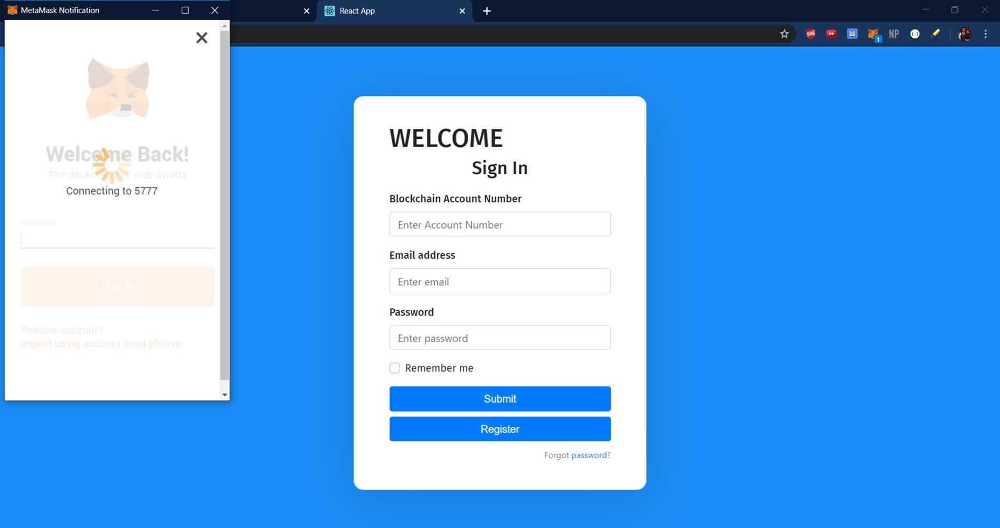
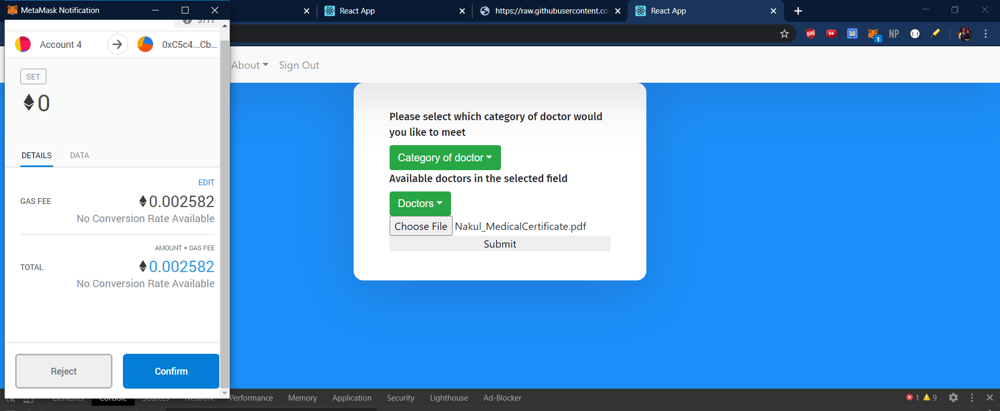
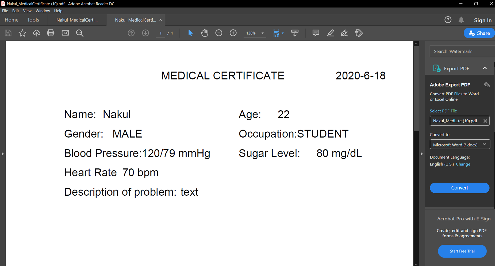

# Decentralized System for medical records
> A blockchain based medical service to help you keep your medical documents secure and help you tranfer your medical records (heart beats, blood pressure etc) to the doctor.

## Installation
 - CLONE THE REPOSITORY
 - NOW INSTALL ALL THE DEPENDENCIES FOR THE PROJECT
  
  ```bash
    npm install
  ```
  
 - RUN THE REACT APPLICATION
 
  ```bash
    npm run start
  ```
  




## Release History

* 0.0.1
    * Work in progress


## Contributing

1. Fork it (<https://github.comketonium10/Decentralized-System-For-Medical-Records/fork>)
2. Create your feature branch (`git checkout -b feature/fooBar`)
3. Commit your changes (`git commit -am 'Add some fooBar'`)
4. Push to the branch (`git push origin feature/fooBar`)
5. Create a new Pull Request
